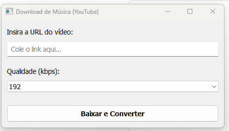

# 🎵 YouTube Downloader (Python + PyQt5)

Um aplicativo desktop simples e eficiente para baixar e converter vídeos do YouTube para MP3.



## 🚀 Funcionalidades
- **Interface Gráfica:** Fácil de usar, construída com PyQt5.
- **Conversão Automática:** Baixa e converte automaticamente para MP3.
- **Anti-Congelamento:** Usa Threads para não travar a tela durante o download.
- **Suporte a Windows:** Compatível com o executável (.exe) gerado pelo PyInstaller.

## 🛠️ Tecnologias Usadas
- Python 3
- PyQt5 (Interface)
- yt-dlp (Download core)
- FFmpeg (Conversão de áudio)

## ⚙️ Pré-requisitos (Windows)
Para que a conversão de áudio funcione, é necessário ter o FFmpeg instalado.
No Windows 10/11, você pode instalar facilmente via terminal (PowerShell):

```powershell
winget install ffmpeg

📦 Como gerar o Executável
Para criar um arquivo .exe único para distribuir:

Bash
py -m pip install PyQt5 yt-dlp pyinstaller
py -m PyInstaller --noconsole --onefile --name="BaixarMusica" convert_ytb_mp3_v2.py


Desenvolvido por Eder🏴‍☠️
